# Divisor de Gastos

Aplicacion web para gestionar grupos, gastos compartidos y balances entre personas.
Permite crear cuentas, organizar grupos, anadir gastos con recibos, enviar notificaciones por email y liquidar deudas de forma sencilla.

## Demo

- Frontend: [https://divisor-de-gastos.onrender.com](https://divisor-de-gastos.onrender.com)
- Backend: [https://divisor-de-gastos-backend.onrender.com](https://divisor-de-gastos-backend.onrender.com)

## Funcionalidades principales

- Registro e inicio de sesion de usuarios.
- Perfil con avatar y edicion de datos.
- Creacion y gestion de grupos.
- Anadir usuarios a grupos mediante busqueda o invitacion por email.
- Registro de gastos con participantes, fecha y recibo.
- Calculo de balances y deudas entre miembros.
- Liquidacion de deudas.
- Emails de bienvenida, invitacion, confirmacion y avisos del sistema.
- Diseno responsive para escritorio y movil.

## Tecnologias

- Frontend: HTML, CSS y JavaScript.
- Backend: Node.js, Express y MongoDB.
- Autenticacion: JWT.
- Emails: Brevo.
- Despliegue: Render.

## Evolucion visual de la aplicacion

Las siguientes imagenes muestran una comparativa entre el estado inicial de la interfaz y las mejoras aplicadas posteriormente.

### Inicio

<table>
  <tr>
    <td align="center" valign="top">
      <strong>Antes</strong><br>
      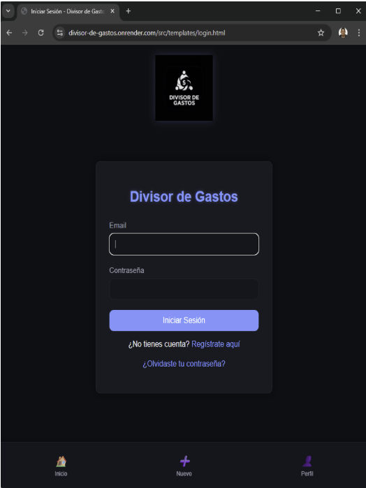
    </td>
    <td align="center" valign="top">
      <strong>Despues</strong><br>
      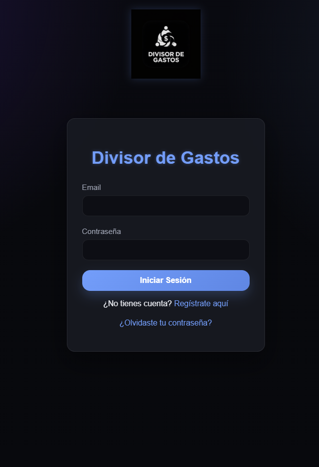
    </td>
  </tr>
</table>

### Crear cuenta

<table>
  <tr>
    <td align="center" valign="top">
      <strong>Antes</strong><br>
      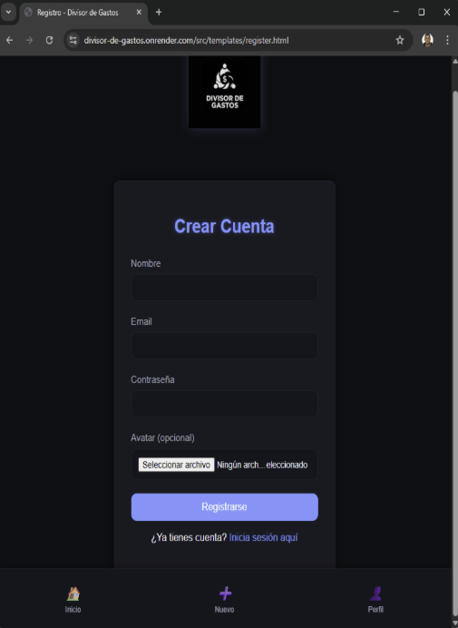
    </td>
    <td align="center" valign="top">
      <strong>Despues</strong><br>
      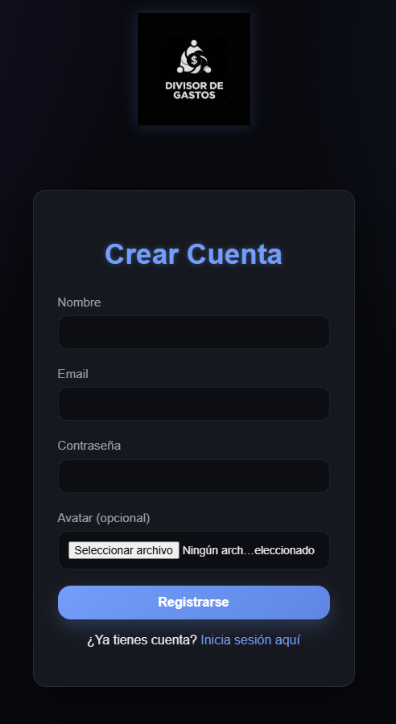
    </td>
  </tr>
</table>

### Resumen global

<table>
  <tr>
    <td align="center" valign="top">
      <strong>Antes</strong><br>
      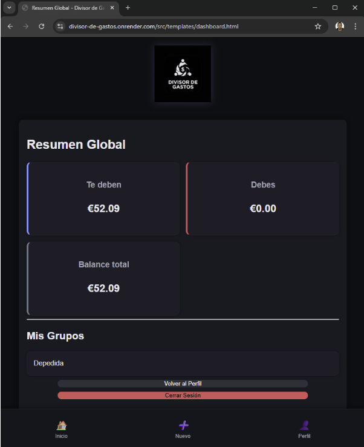
    </td>
    <td align="center" valign="top">
      <strong>Despues</strong><br>
      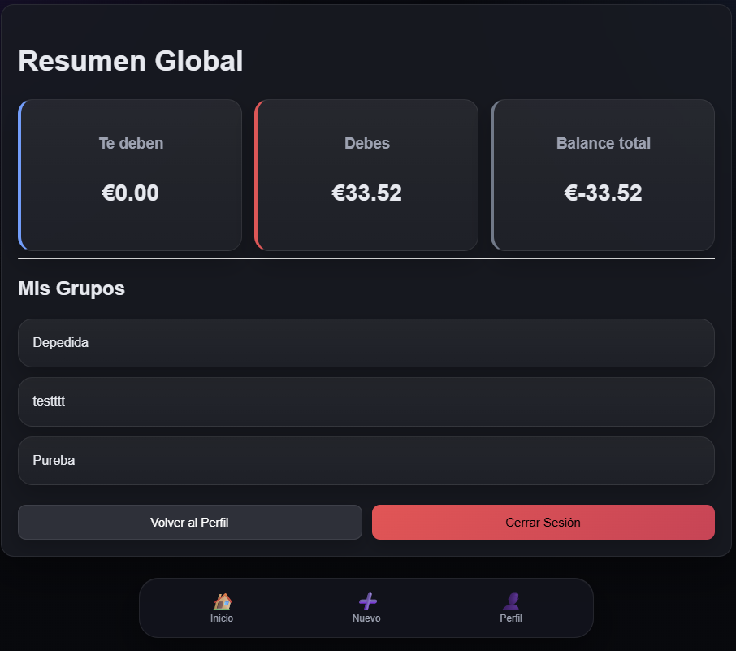
    </td>
  </tr>
</table>

### Vista del grupo

<table>
  <tr>
    <td align="center" valign="top">
      <strong>Antes</strong><br>
      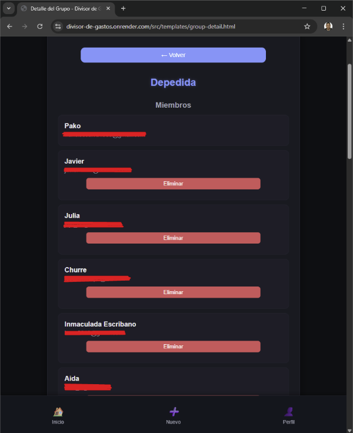
    </td>
    <td align="center" valign="top">
      <strong>Despues</strong><br>
      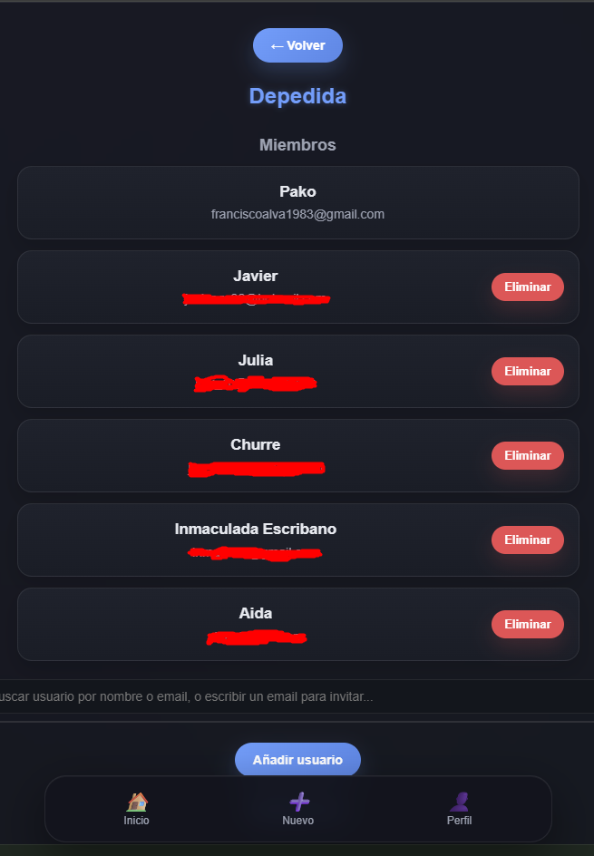
    </td>
  </tr>
</table>

### Balances

<table>
  <tr>
    <td align="center" valign="top">
      <strong>Antes</strong><br>
      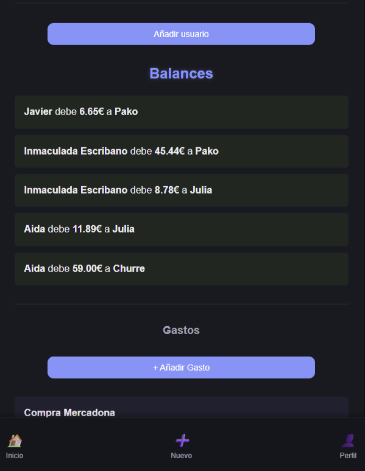
    </td>
    <td align="center" valign="top">
      <strong>Despues</strong><br>
      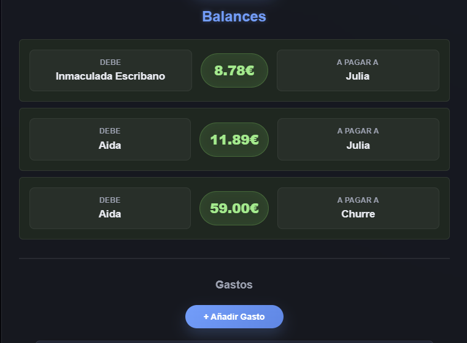
    </td>
  </tr>
</table>

### Gastos

<table>
  <tr>
    <td align="center" valign="top">
      <strong>Antes</strong><br>
      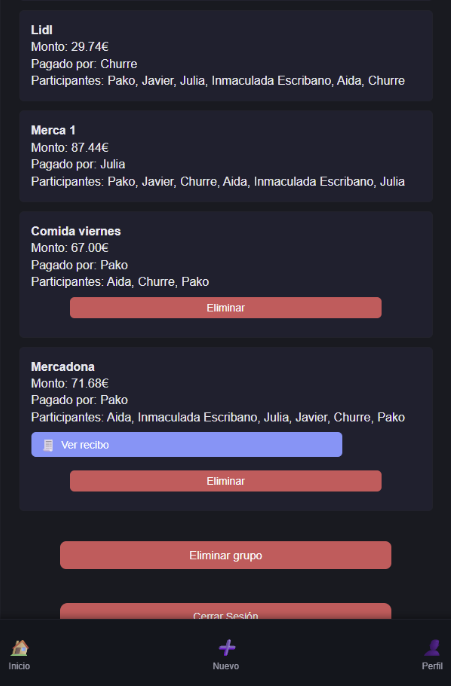
    </td>
    <td align="center" valign="top">
      <strong>Despues</strong><br>
      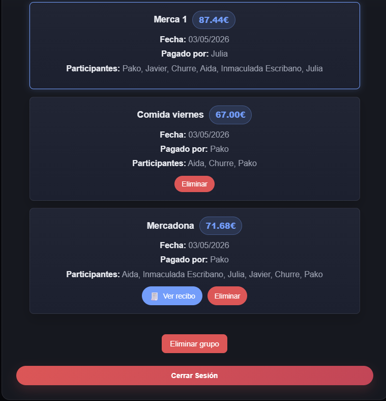
    </td>
  </tr>
</table>

### Perfil

<p align="center">
  
</p>

## Instalacion local

1. Clona el repositorio.
2. Instala dependencias en backend y frontend.
3. Configura las variables de entorno.
4. Arranca primero el backend y despues el frontend.

### Backend

```bash
cd backend
npm install
npm start
```

### Frontend

```bash
cd frontend
npm install
npm start
```

## Variables de entorno

Ejemplo orientativo para el backend:

```env
PORT=10000
MONGO_URI=tu_uri_de_mongodb
JWT_SECRET=tu_clave_secreta
FRONTEND_URL=https://divisor-de-gastos.onrender.com
BREVO_API_KEY=tu_api_key
BREVO_FROM=tu_correo_verificado
```

## Autor
Francisco Rafael Alvarez Rama
Proyecto desarrollado como TFG y publicado en GitHub con despliegue en Render.
