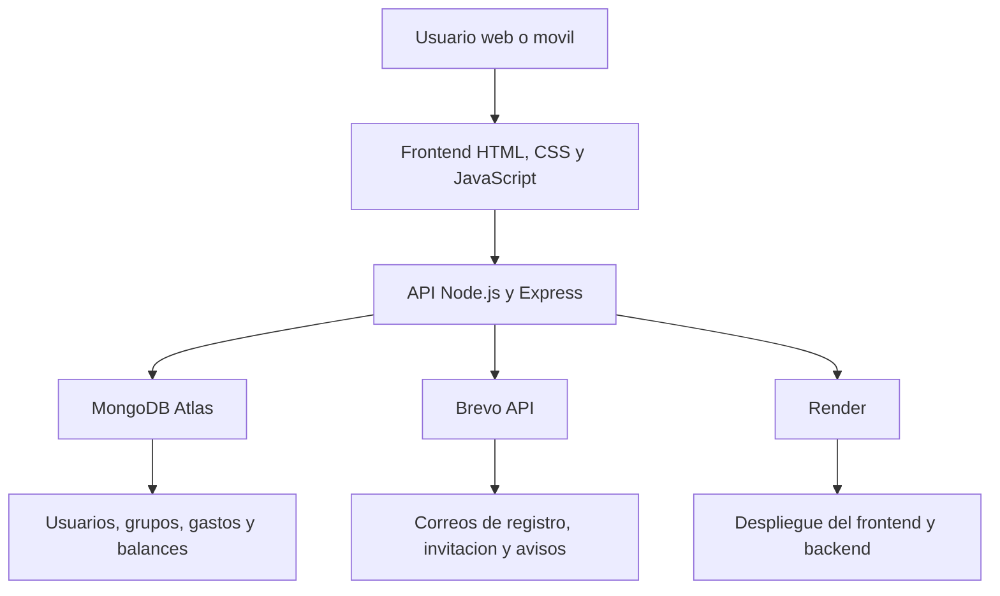

# Divisor de Gastos

[](https://divisor-de-gastos.onrender.com)
[](https://divisor-de-gastos-backend.onrender.com)
[](https://nodejs.org/)
[](https://www.mongodb.com/)

Aplicacion web para gestionar grupos, gastos compartidos y balances entre personas.
Disenada para registrar usuarios, organizar equipos, dividir gastos, automatizar avisos por email y liquidar deudas de forma clara y rapida.

## Capturas principales

<p align="center">
  
</p>

## Resumen del proyecto

- Gestion de usuarios con registro, inicio de sesion y perfil con avatar.
- Creacion de grupos, alta y baja de miembros y control de balances.
- Registro de gastos con fecha, participantes y recibo adjunto.
- Invitaciones por email para usuarios no registrados.
- Confirmaciones y notificaciones automaticas por correo.
- Interfaz responsive adaptada a escritorio y movil.
- Despliegue en Render con persistencia en MongoDB Atlas.

## Problema que resuelve

El proyecto surge para simplificar la gestion de gastos compartidos en grupos de amigos, familia o convivencia.
Evita calculos manuales, centraliza la informacion en una sola aplicacion y permite saber rapidamente quien debe dinero y cuanto.

## Caracteristicas destacadas

### Funcionales

- Registro e inicio de sesion.
- Recuperacion de contrasena por email.
- Alta de grupos con usuarios existentes o invitaciones a nuevos correos.
- Registro de gastos con fecha y archivo del recibo.
- Cierre de deudas con actualizacion inmediata del balance.
- Envio de emails de bienvenida, invitacion, grupo eliminado, miembro eliminado y liquidacion.

### Experiencia de usuario

- Diseno visual oscuro, moderno y centrado en tarjetas.
- Vista adaptada a moviles con barra inferior de navegacion.
- Botones claros para acciones frecuentes.
- Galerias y bloques visuales para entender rapido cada grupo.

## Arquitectura de la solucion



## Stack tecnico

- Frontend: HTML, CSS y JavaScript puro.
- Backend: Node.js + Express.
- Base de datos: MongoDB Atlas.
- Autenticacion: JWT.
- Subida y gestion de recibos: multer + almacenamiento local o persistente segun entorno.
- Emails transaccionales: Brevo.
- Hosting: Render.

## Evolucion visual

La siguiente comparativa muestra como fue evolucionando la interfaz durante el desarrollo.

### Inicio

<table>
  <tr>
    <td align="center" valign="top">
      <strong>Antes</strong><br>
      
    </td>
    <td align="center" valign="top">
      <strong>Despues</strong><br>
      
    </td>
  </tr>
</table>

### Crear cuenta

<table>
  <tr>
    <td align="center" valign="top">
      <strong>Antes</strong><br>
      
    </td>
    <td align="center" valign="top">
      <strong>Despues</strong><br>
      
    </td>
  </tr>
</table>

### Resumen global

<table>
  <tr>
    <td align="center" valign="top">
      <strong>Antes</strong><br>
      
    </td>
    <td align="center" valign="top">
      <strong>Despues</strong><br>
      
    </td>
  </tr>
</table>

### Vista del grupo

<table>
  <tr>
    <td align="center" valign="top">
      <strong>Antes</strong><br>
      
    </td>
    <td align="center" valign="top">
      <strong>Despues</strong><br>
      
    </td>
  </tr>
</table>

### Balances

<table>
  <tr>
    <td align="center" valign="top">
      <strong>Antes</strong><br>
      
    </td>
    <td align="center" valign="top">
      <strong>Despues</strong><br>
      
    </td>
  </tr>
</table>

### Gastos

<table>
  <tr>
    <td align="center" valign="top">
      <strong>Antes</strong><br>
      
    </td>
    <td align="center" valign="top">
      <strong>Despues</strong><br>
      
    </td>
  </tr>
</table>

### Perfil

<p align="center">
  
</p>

## Manual de instalacion local

### 1. Clonar el repositorio

```bash
git clone https://github.com/Pako1983/divisor-de-gastos.git
cd divisor-de-gastos
```

### 2. Instalar dependencias

```bash
cd backend
npm install
cd ../frontend
npm install
```

### 3. Configurar variables de entorno

Ejemplo orientativo para el backend:

```env
PORT=10000
MONGO_URI=tu_uri_de_mongodb
JWT_SECRET=tu_clave_secreta
FRONTEND_URL=https://divisor-de-gastos.onrender.com
BREVO_API_KEY=tu_api_key
BREVO_FROM=tu_correo_verificado
```

### 4. Arrancar el proyecto

```bash
# Backend
cd backend
npm start

# Frontend en otra terminal
cd frontend
npm start
```

## Despliegue

- Frontend publicado en Render como sitio estatico.
- Backend desplegado como servicio web en Render.
- Base de datos alojada en MongoDB Atlas.
- Emails gestionados con Brevo.

## Posibles mejoras futuras

- Exportacion de balances a PDF o Excel.
- Mejoras en analitica y estadisticas por grupo.
- Persistencia de archivos en almacenamiento externo para recibos.
- Panel de administracion para grupos grandes.

## Autor
Francisco Rafael Alvarez Rama
Proyecto desarrollado como TFG y publicado en GitHub con despliegue en Render.

